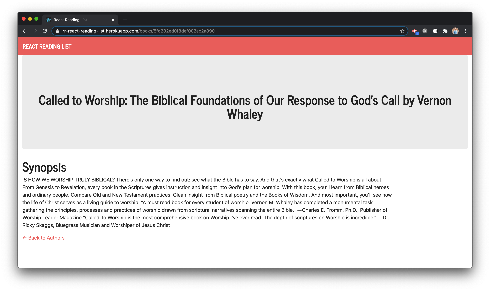

# In-Class Activity: React Reading List

## Description
This repository holds the in-class activity for Week 21 of the [The Coding Boot Camp](https://techbootcamps.utexas.edu/coding/) through the University of Texas at Austin's Center for Professional Education.

The scope of this project is to finish the code that will allow for complete functionality of a full stack web application using the MERN stack and then deploy to Heroku.

## Notes
This application uses [mongoose](https://www.npmjs.com/package/mongoose) to handle the MongoDB (Atlas) functionality, [Express.js](https://expressjs.com/) to build the app, [React.js](https://reactjs.org/) to handle the front-end framework UI components and [Node.js](https://nodejs.org/en/) for the JavaScript runtime.

This application also utilizes [react-router-dom](https://www.npmjs.com/package/react-router-dom) to allow for multiple routes within a single-page application.

## Instructions
This project is deployed on Heroku [here](https://rr-react-reading-list.herokuapp.com/).

## Page Screenshots
Main Page

Individual Book Page

## Contributing
Any and all collaboration is welcome so if you have any suggestions or thoughts for new features, please send me an email at ryan.rotman@gmail.com.